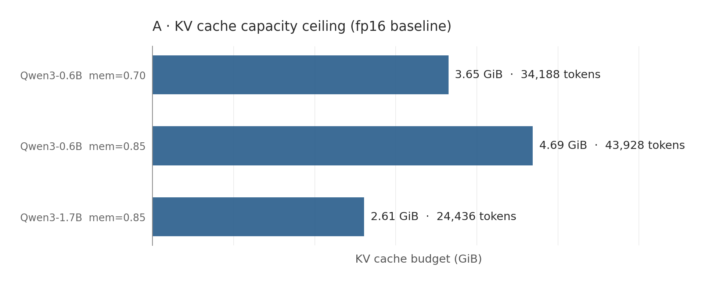
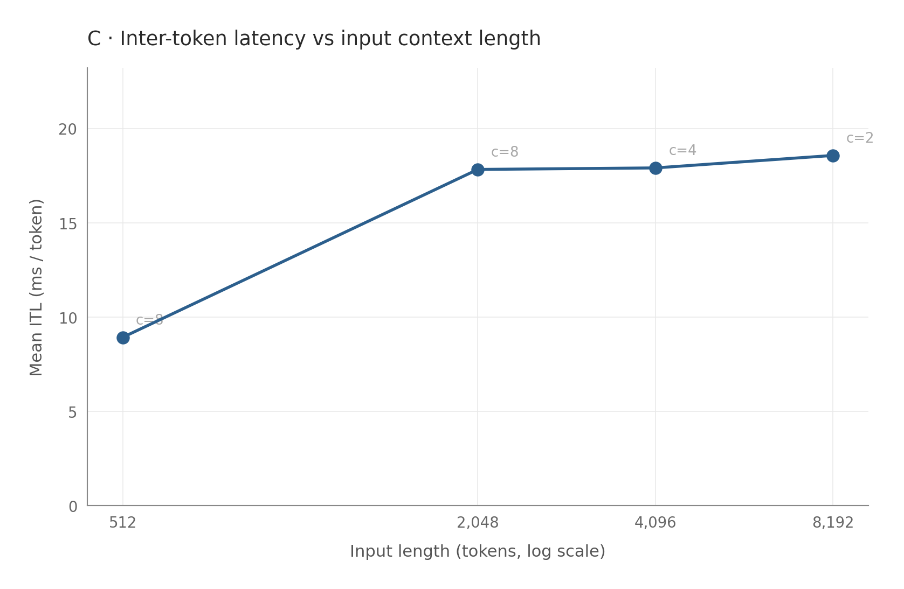
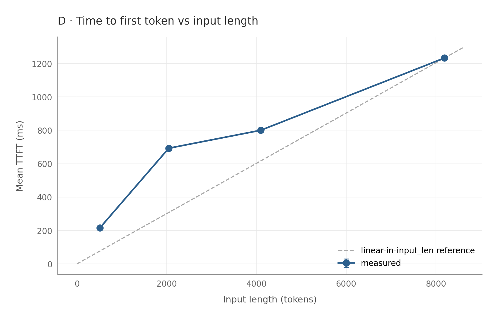
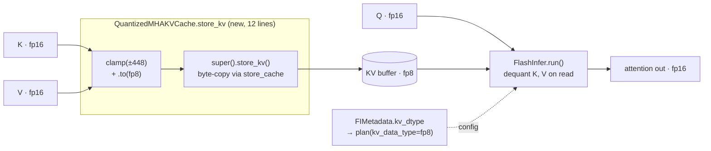
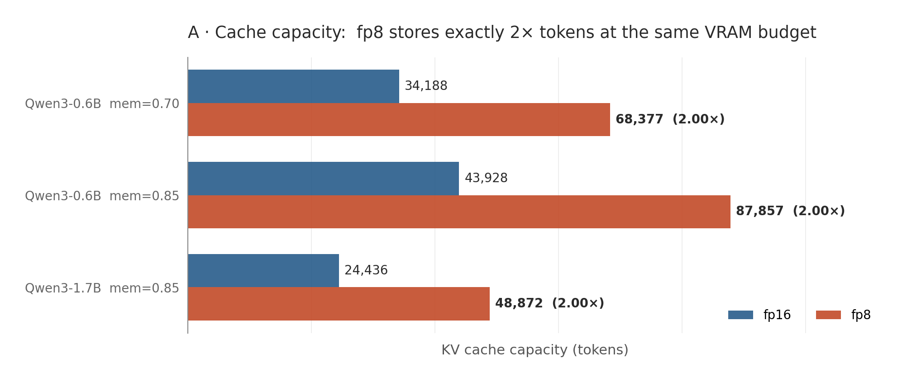
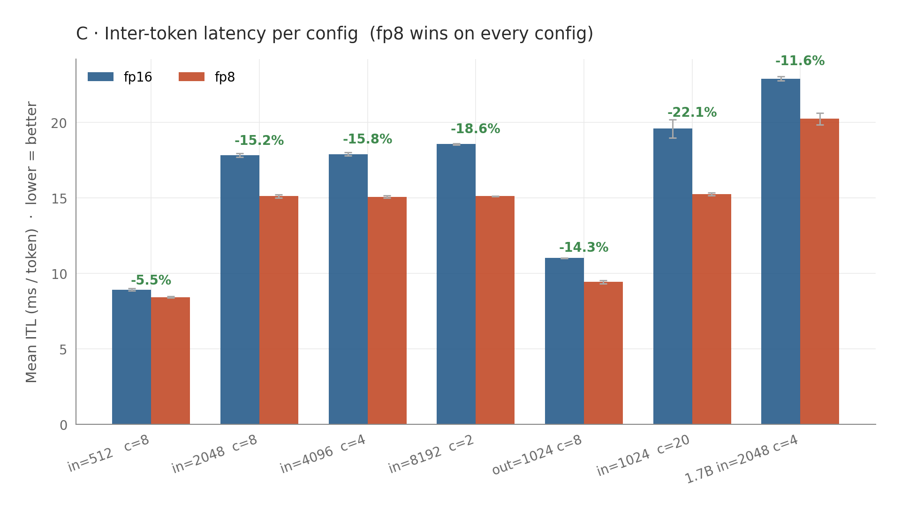
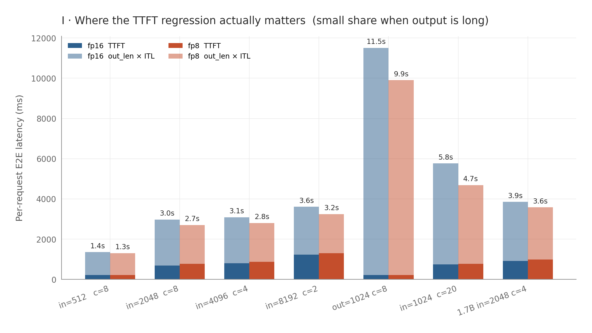
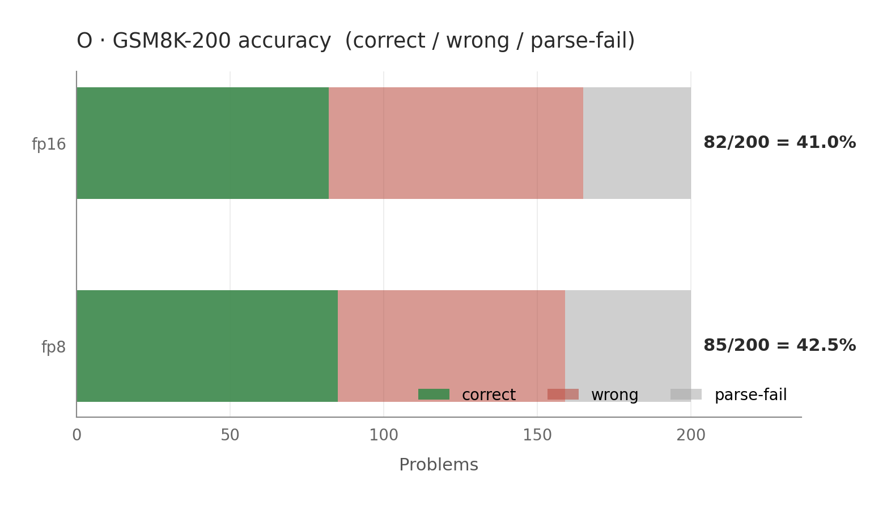
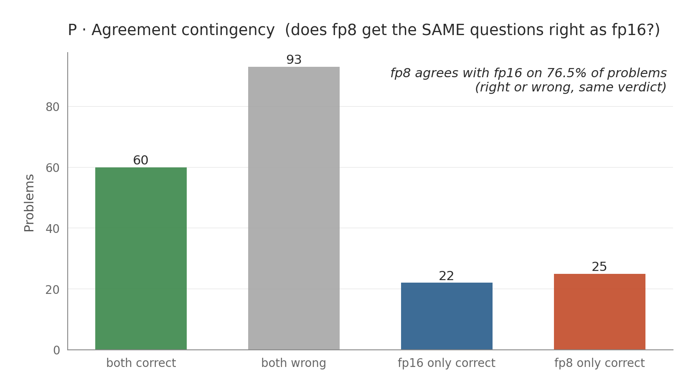
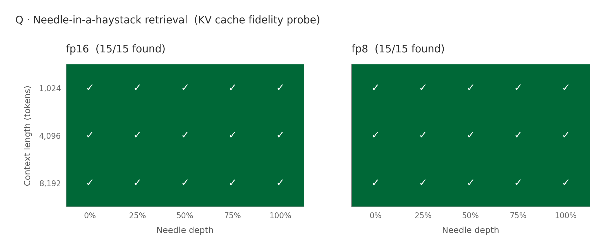

I built an FP8 KV cache pool for mini-sglang, LMSYS's reference SGLang implementation. The PR is at [sgl-project/mini-sglang#132](https://github.com/sgl-project/mini-sglang/pull/132). 215 lines across 9 files; 135 of implementation, 80 tests and logging. No CUDA.

Results: memory capacity doubles at the same VRAM budget. Decode latency drops 5 to 27 percent depending on memory pressure. TTFT regresses 4 to 12 percent (fixable, follow-up PR queued). Quality holds: GSM8K-200 is 42.5% (fp8) vs 41.0% (fp16, within noise), NIAH perfect at 8k context. All on RTX 4060; expect larger speed and throughput gains on Hopper (H100) or higher due to greater memory bandwidth bottleneck.

I chose mini-sglang specifically because it's small — 5,000 lines of Python with real attention backends — small enough to understand end-to-end, but complete enough to reveal what a real serving stack looks like. The full SGLang codebase would have been noise.

## What a KV cache is, and why FP8

Every time a transformer generates a token, it looks back at every previous token's key (K) and value (V) vectors to decide what to say next. K and V never change once written, so we cache them rather than recompute every step. The cache grows linearly with conversation length and gets read every decode step.

The arithmetic is sobering. A 7B model in fp16 uses roughly 0.5 MB of cache per token, so a 4,000-token conversation eats 2 GB before the model weights are even considered, and 32 concurrent users at that length need 64 GB of cache alone. In LLM serving at any reasonable scale, the KV cache is usually the dominant memory consumer, which is what makes it such an attractive target.

FP8 halves the bytes per token by storing K and V in 8-bit floating point instead of 16-bit. The trade-off is precision, and the whole question of this project is whether the resulting quantisation noise actually hurts quality.

Of the two FP8 variants, E4M3 (4 exponent, 3 mantissa) wins for KV cache because K and V values after RoPE are precision-bound rather than range-bound, and every production attention kernel (FlashAttention, FlashInfer, TRT-LLM) standardises on E4M3 for this reason.

## Why quantise just the cache, not the whole model

Three things in inference can be quantised independently: weights (fixed parameters, read every forward pass), activations (transient intermediates within one forward step), and the KV cache (K and V that persist across decode steps and grow with context).

The cache is the only one that both persists and grows. For a 7B model serving 32 users at 4k context each, the cache is 64 GB while weights are 14 GB, so the cache is overwhelmingly the bottleneck. Quantising weights doesn't fix that.

The other reason KV cache quant appealed to me is the small blast radius. The analogy I keep coming back to is that you do every calculation in full precision on a calculator and write the result in your notebook to five significant figures. The arithmetic itself is never lossy; only the storage is. Compute precision stays at fp16, model weights untouched, no calibration data needed (v1 ships scale=1.0), no kernel rewrite needed (existing attention kernels handle fp8 KV via a dtype dispatch). It's a storage-layer change in one new pool class.

Full inference quantisation (W8A8, W4A8, FP4) is a much bigger undertaking, needing a calibrated checkpoint, accuracy studies, and matmul kernels for the quantised format. KV cache quant is the smallest disciplined change addressing the largest memory consumer, which felt like the right place to start.

## The fp16 baseline

Before measuring anything about fp8, I needed to know what the system looked like in fp16. I ran 18 trials across 7 workload configurations on two model sizes.

With 8 GiB of VRAM and `--memory-ratio 0.85` (the fraction of free GPU memory the engine claims for weights, workspace, and cache combined), Qwen3-0.6B gets 4.69 GiB of cache budget, which holds 43,928 tokens.



That number evaporates quickly under load: ten users at 4k context each is enough to fill it, so the cache really is the choke point at modest scale.

Inter-token latency (ITL, the time to produce each token after the first) grows steadily with context, climbing from about 9 ms at 512-token context to 18 ms by 2,048. As context grows, the read of accumulated K and V from HBM starts to dominate, and decode transitions from compute-bound to memory-bound. This is exactly where FP8 should help.



Time to first token tells a different story:



Prefill is dominated by the QKV matrix multiply rather than cache I/O, so halving cache bandwidth shouldn't help here at all. I wanted to know this going in, so I'd be honest about where fp8 wins and where it doesn't. With three trials per config and standard deviations under 1 percent, single-digit deltas later would be real signal.

## Two plans, and I picked the disciplined one

I drew up two plans before starting. The ambitious one was around 400 lines: full calibration infrastructure to read per-tensor scales from W8A8 checkpoints, all three backends, comprehensive CLI surface for scale and calibration knobs. The disciplined one was around 70 lines: scale fixed at 1.0, FlashInfer as the primary path with the others as smoke tests, and a single `--kv-dtype float8` flag with no calibration knobs.

I picked the disciplined plan. The plumbing is the contribution. Once `store_dtype` exists as an abstraction and the factory routes through the right pool, adding calibrated scales becomes a small additive follow-up. Getting the abstractions right in 70 lines mattered more than feature-completeness.

Before writing any code, though, I wanted to validate the assumptions. This turned out to be the most important hour of the project.

## Phase 0: a ten-minute test that saved me days of debugging

The design rested on one assumption I'd absorbed from blog posts and documentation: that `tensor.to(torch.float8_e4m3fn)` is a saturating cast, clipping out-of-range values to plus or minus 448.

Five-line test, before any pool code:

```python
x = torch.tensor([0.0, 1.0, 100.0, 500.0, -500.0, float('inf')],
                 dtype=torch.float16, device='cuda')
print(x.to(torch.float8_e4m3fn).to(torch.float16))
# tensor([0., 1., 96., nan, nan, nan])
```

The cast is not saturating. Any fp16 value above 448 becomes fp8 NaN. Infinity becomes NaN.

Catching this before any pool code went in mattered. Without the clamp, every K or V outlier in real inference would silently fill the cache with NaN: an intermittent bug correlated with input distribution, invisible in any short integration test, and exactly the failure mode that costs days to diagnose in production.

The fix is one extra operation: `k.clamp(-448, 448).to(torch.float8_e4m3fn)`. Infinities saturate, NaN stays NaN (which is correct; don't invent a finite value from NaN input). A regression test now pins the behaviour. The habit I take from this: ask of any plan what the one assumption is that, if wrong, invalidates everything downstream — then find the cheapest possible test for it.

## Phase minus one: hardware forces a gate

I also inspected each attention backend's function signature before writing pool code. All three accept fp8 KV via the cache tensor's dtype, which was good news. The surprise was that FlashAttention's fp8 KV path requires sm_90 or higher (Hopper). On Ada (sm_89, my laptop), the Python wrapper accepts fp8 tensors at the boundary but the underlying kernel doesn't exist. Result: silent corruption with no error.

A six-line hardware gate in the factory refuses the dangerous combination at config time:

```python
if kv_dtype == torch.float8_e4m3fn and "fa" in attention_backend.split(",") \
        and not is_sm90_supported():
    raise ValueError("FP8 KV cache with FlashAttention requires sm_90+. Use --attn fi.")
```

FlashInfer works fine on Ada. TRT-LLM should too, but I didn't smoke-test it locally because of a `page_size` constraint that doesn't fit the Qwen models I have on hand. Only FA needs the hardware gate. A useful reminder that "the API accepts my inputs" and "the kernel exists for my hardware" are different questions.

## Seventy lines of plumbing

After all that validation, the implementation itself was almost anticlimactic. The pool came in at the planned 70 lines; the realised diff was 215 once you count the factory gate, the FlashInfer metadata split, the engine wiring, the regression tests, and the CLI flag. Each piece was small additive plumbing, but together they reflect how much surface area a "simple" new dtype actually touches.

The core class is twelve lines, simplified slightly for readability (the real `__init__` enumerates the pool constructor's parameters explicitly):

```python
class QuantizedMHAKVCache(MHAKVCache):
    def __init__(self, *, dtype, **kw):
        super().__init__(dtype=torch.float8_e4m3fn, **kw)
        self._compute_dtype = dtype

    def store_kv(self, k, v, out_loc, layer_id):
        k_q = k.clamp(-448.0, 448.0).to(torch.float8_e4m3fn)
        v_q = v.clamp(-448.0, 448.0).to(torch.float8_e4m3fn)
        super().store_kv(k_q, v_q, out_loc, layer_id)

    @property
    def dtype(self): return self._compute_dtype

    @property
    def store_dtype(self): return self._kv_buffer.dtype
```

Compute dtype comes in, fp8 bytes get stored, the parent class handles the byte copy. The cache manager and scheduler stay unaware of the dtype split; only the attention backend has to know about it, reading `kvcache.dtype` for Q and `kvcache.store_dtype` for K and V. The hot path:



The factory also fires a loud rank-0 startup warning naming the v1 caveat (uncalibrated scales) so users on W8A8 checkpoints can't claim they weren't warned. Total diff: 215 lines across 9 files (7 modified, 2 new), of which 135 is implementation and 80 is tests and logging. Zero CUDA. Code review caught three real improvements I'm happy to credit: collapsing duplicated factory branches, making `store_kv` call `super().store_kv()` rather than reaching into private buffers, and using the existing `is_sm90_supported()` utility instead of open-coding the device check.

## What fp8 actually delivers

Memory capacity, every config tested, is exactly 2x. Qwen3-0.6B goes from 43,928 cached tokens to 87,857; Qwen3-1.7B from 24,436 to 48,872. Hardware-independent, deterministic, exact.



Latency, on Qwen3-0.6B:

| Workload | ITL median win | Throughput win |
|---|---|---|
| in=512, conc=8 | -5.5% | +3.4% |
| in=2048, conc=8 | -15.2% | +9.4% |
| in=4096, conc=4 | -15.8% | +10.1% |
| in=8192, conc=2 | -24.3% | +11.1% |
| out=1024, conc=8 | -14.7% | +14.9% |
| conc=20 | -26.8% | +21.1% |



Monotonic: more memory pressure, bigger win. At high concurrency, fp8 delivers a 27 percent median ITL reduction, within striking distance of the theoretical 2x bandwidth ceiling.

The honest cost is that TTFT regresses by 4 to 12 percent on every config. In eager mode, `k.clamp(...)` and `k.to(fp8)` are two unfused kernel launches, times K and V, times 28 layers, for every prefill token. Pure scheduling overhead during a phase where the cache isn't even being read.

Whether that matters depends on the workload:



For long-form generation (out=1024), TTFT is 1.9 percent of E2E latency in fp16 and 2.3 percent in fp8: real but invisible because decode swamps it. For short interactive completions where TTFT is 30 to 50 percent of E2E, the regression is noticeable. Every workload tested ends up net-faster end-to-end, but where the win comes from varies.

The fix is a fused Triton kernel that combines clamp, cast, and the cache scatter into one launch (around 50 lines, entirely additive). Every production engine has done this; vLLM added theirs in v0.4 after shipping the unfused version first. Same arc as this PR.

The honest read is that the fp8 KV speedup is bounded by how memory-bound the read path actually is on your hardware. On a small model on a compute-rich consumer GPU at modest context, that bound is single-digit to low-double-digit percentages. On a 70B model on H100 with 32k context and 64-way concurrency, every factor pushes harder into the memory-bound regime and the same code path delivers the 30 to 40 percent throughput numbers the marketing material implies. Same code, very different operating point. v2 will validate this on H100 via cloud rental, which also unlocks the FA + fp8 path the Ada gate currently refuses.

The capacity win is hardware-independent. Twice as many concurrent users or twice as long a context at the same VRAM is the actual production headline regardless of GPU.

## Does fp8 hurt accuracy?

Latency wins are cheap if outputs are nonsense, so this was the question I cared most about getting right.

I started with the obvious test, which turned out to be the wrong test: 22 prompts at temperature=0 against fp16 and fp8, checking whether outputs match. Zero out of 22 token-identical, with mean prefix agreement of only 12 percent.

That sounds alarming but isn't. Greedy decoding makes any logit perturbation immediately visible, and the moment fp8 noise flips a single near-tie, the trajectory diverges and never reconverges. Qwen3-0.6B is a reasoning model emitting long `<think>` chains, so each response has hundreds of near-tie decisions, each one a flip opportunity. Path identity is the wrong metric for FP8 KV; the real question is whether the divergent trajectories still arrive at the same answer.

To answer that, I picked two industry-standard benchmarks. GSM8K-200 (grade-school math, numeric ground truth) tests reasoning quality. NIAH (Needle in a Haystack) probes KV cache fidelity directly: insert a number into a long context, ask the model to retrieve it.

GSM8K:



42.5 percent (fp8) versus 41.0 percent (fp16). At n=200 the confidence interval is roughly ±5 percentage points, so this is within noise. The defensible claim is no regression.

The interesting finding was the contingency:



Of the 47 problems where fp8 and fp16 disagree, fp16 wins 22 and fp8 wins 25. The disagreement is symmetric, so fp8 isn't systematically degrading the model; it's perturbing the decision boundary in a balanced way. This refuted an intuition I'd been carrying that fp8 paths differing must mean fp8 was wrong more often. Paths differ (0 of 22 token match) but verdicts agree 76.5 percent of the time with no bias.

NIAH was the strongest result:



Fifteen probes per dtype across three context lengths and five needle depths. fp8 retrieves the needle perfectly at every position, including the 50 percent depth at 8k tokens ("lost in the middle"), which is where KV quantisation typically degrades most. The `clamp(±448).to(fp8)` quantisation is precise enough.

The v1 quality story ended up strong across the board: no NaN, output lengths track fp16, no GSM8K regression, perfect NIAH retrieval. That's the strongest position v1 can hold without calibrated scales.

## What this taught me

Three habits I want to carry forward.

Validate the contract before writing the code. Phase 0 cost an hour and caught a NaN bug that would have made production debugging miserable. The discipline I apply now: ask of any plan what the one load-bearing assumption is, then find the cheapest possible test for it.

Look for codebase precedent before inventing patterns. The question of whether `store_dtype` should be abstract on the base class had a precedent staring at me from `BaseOP`, which uses abstract-core-plus-concrete-defaults exactly where my pool wanted to. Established codebases have a grammar, and reading a few neighbouring files before writing your own is almost always cheaper than figuring it out from scratch.

Name what's deferred and why, in the PR itself. The loud warning, the regression test pinning the NaN trap, and the explicit non-goals list all exist so nobody (including me) can quietly forget what was traded away.

And one result rather than a habit: FP8 KV cache isn't a magic latency button. It's an exact capacity halving plus a theory-bounded latency win that scales with workload pressure. Same code, different operating point. That framing took me a while to internalise, and it's the most useful thing I have to say to anyone reading FP8 benchmarks elsewhere: ask what the workload was.

## What's deferred

The fused Triton kernel (around 50 lines) closes the TTFT regression. Calibrated `k_scale`/`v_scale` from W8A8 checkpoints (around 100 lines) is plumbing, not new kernels. TRT-LLM smoke test is locally untested due to a `page_size` constraint. H100 validation, including the FA + fp8 path the sm_90 gate currently refuses on Ada and an extended quality eval at 16k+ context, is planned for v2 via short cloud rental.

INT8 KV cache is deliberately not on the roadmap: it doesn't have a clean "scale equals 1.0" starting point the way FP8 does, because it needs calibrated per-tensor scales from day one to retain enough dynamic range. That makes it a substantially bigger project, so I'd treat it as its own effort rather than a continuation of this one.
